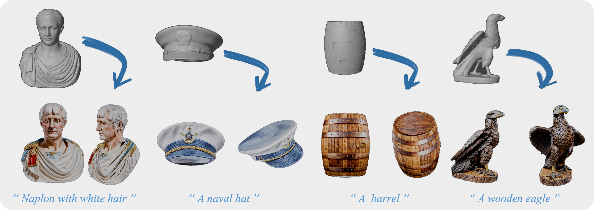
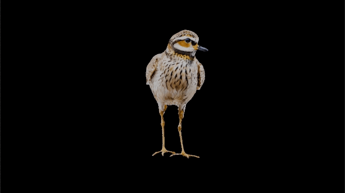
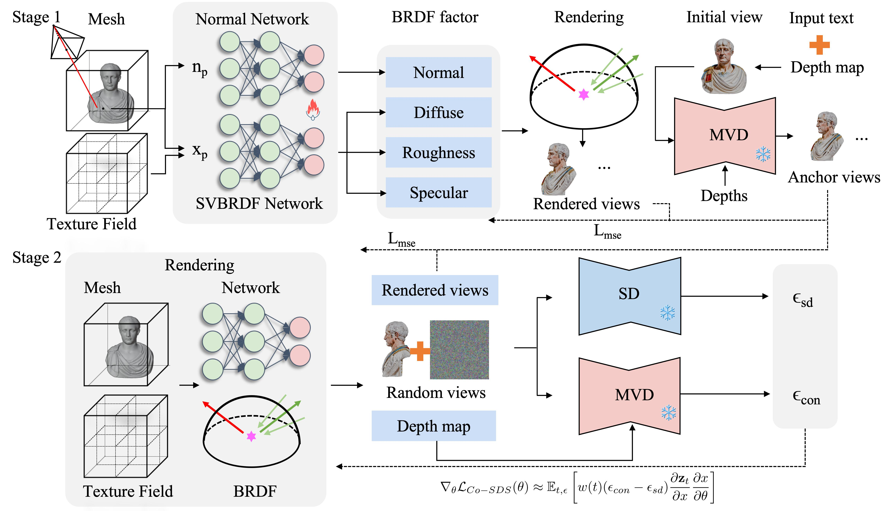
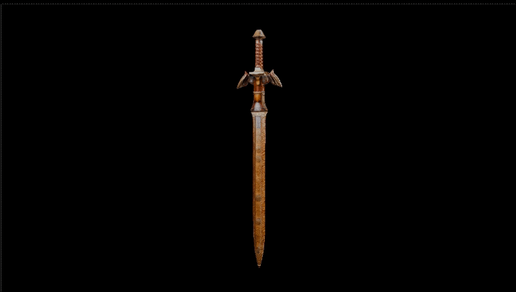
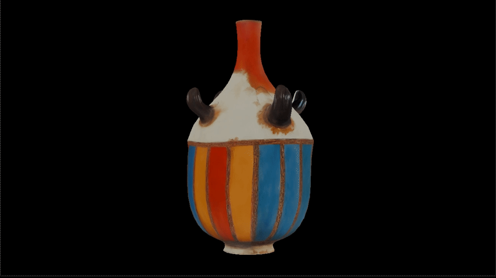
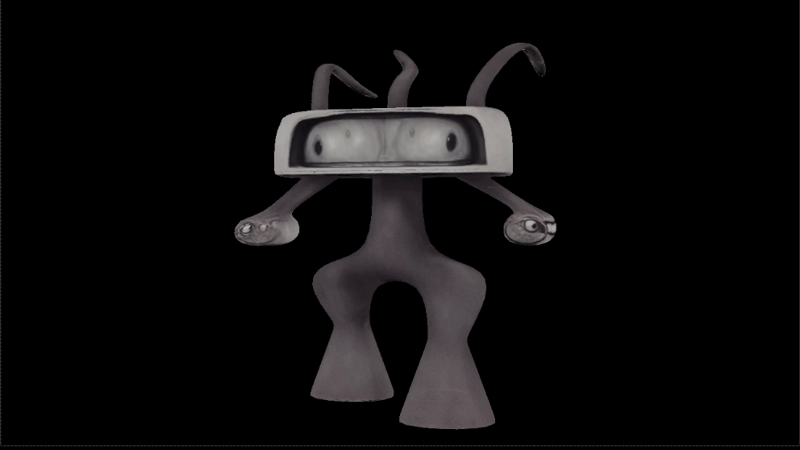

# TexDreamer: Text-driven Photorealistic and Robust Texture Synthesis via Multi-View Diffusion

### [Project Page](https://texdreamer.github.io/TexDreamer/)  | [GitHub]() | [Paper]()

  

<figcaption style="text-align:justify; margin: 0 auto; display: table;">
Recent advances in image and 3D generation have propelled the field forward, yet challenges remain in synthesizing highly detailed, view-consistent textures for 3D objects. To address these issues, we introduce TexDreamer, a novel method that generates high-quality 3D textures on meshes using text prompts.
Our contributions include a hybrid methodology that integrates the descriptive power of texture field representations with the structure of a multi-view diffusion model and Score Distillation Sampling (SDS). TexDreamer leverages a continuous texture field to capture intricate details and sophisticated material attributes while ensuring view consistency via multi-view diffusion guidance. We further disentangle the visual appearance through a spatially varying bidirectional reflectance distribution function (BRDF), jointly optimized with a hybrid loss function to enhance texture fidelity. To address intermediate texture regions, we propose a Co-SDS loss that promotes completeness and detail precision. Evaluations of various 3D models reveal TexDreamer’s ability to generate detailed, text-aligned textures with material realism and robust consistency across views, outperforming current state-of-the-art methods in quality and fidelity. 
</figcaption>

  

   Napoleon with white hair 
        
     
  

  

  A barrel 
        
     
  

  

  A wooden eagle
        
     
  

  

  A golden plover 
        
     
  

### Approach

<figcaption style="text-align: justify;">We introduce TexDreamer, a two-stage coarse-to-fine approach for text-driven photorealistic 3D texture synthesis, designed to generate high-quality textures for any bare mesh, as illustrated in Figure. The process begins with a BRDF-based forward model that decomposes appearance into diffuse, rough, specular, and normal components (Section 4.1). In the first stage, we apply a multi-view diffusion model to produce four anchor views (Section 4.2). Information from these anchor views is then utilized to carry out an initial refinement of the texture field, aiming to enhance foundational detail and coherence. In the second stage, we introduced a hybrid loss function for texture optimization (Section 4.3). The Mean Squared Error (MSE) and Co-SDS losses are applied to synthesize textures for novel viewpoints while maintaining the integrity of textures in the anchor views.</figcaption>

  

### More results

  

   A brown horse 
        
     
  

  

  A packbag 
        
     
  

  

  A Chinese bell
        
     
  

  

  A sword 
        
     
  

  

   A colorful vase 
        
     
  

  

  A cute  bunny 
        
     
  

  

  An alien
        
     
  

  

  A canvas boot 
        
     
  

